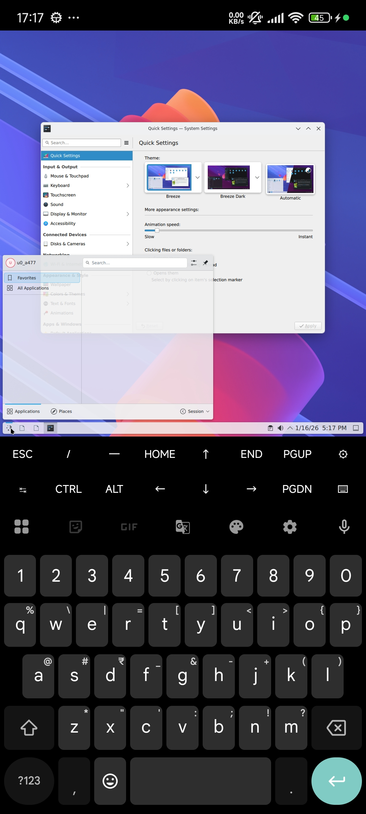
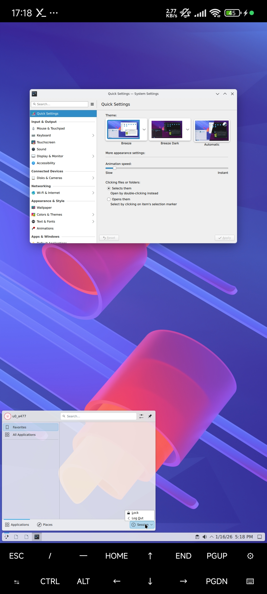

# termux-kde-builds [unusable], native build no root, no proot
- Build Process is based from My_kde_v2.sh
- My_kde.sh and  My_kde_v2.sh are for just notes

Image 1             |  Image 2
:-------------------------:|:-------------------------:
  |  
# Usage
```
termux-x11 :1 -xstartup "dbus-launch --exit-with-session plasma_session"
```

# Build Process Below
- below order need to update but still works

# Prerequisites
```
termux-change-repo
pkg update && pkg upgrade

pkg i wget curl git nano vim htop tar unzip openssh tmux
pkg i x11-repo tur-repo
pkg i termux-x11-nightly dbus
pkg in kf6* qt6* build-essential extra-cmake-modules ninja mesa mesa-dev libglvnd-dev libwayland-protocols vulkan-headers plasma-wayland-protocols jq libcap boost boost-headers xorgproto libxss sdl2
pkg i pulseaudio
```
```
mkdir Plasma-6.5.2 && cd Plasma-6.5.2
url=https://download.kde.org/stable/plasma/6.5.2/
wget -r -nH -nd -A '*.xz' -np $url
```
# layer-shell-qt
```
pkg in layer-shell-qt
```

# kwayland
```
cd && cd Plasma-6.5.2
tar -xf kwayland-6.5.2.tar.xz
cd kwayland-6.5.2
mkdir build && cd build
cmake ..   -DCMAKE_INSTALL_PREFIX=$PREFIX   -DCMAKE_BUILD_TYPE=Release   -DCMAKE_SYSTEM_NAME=Linux   -DBUILD_TESTING=OFF
make -j$(nproc)
make install
```

# kdecoration
```
cd && cd Plasma-6.5.2
tar -xf kdecoration-6.5.2.tar.xz
cd kdecoration-6.5.2
mkdir build && cd build
cmake ..   -DCMAKE_INSTALL_PREFIX=$PREFIX   -DCMAKE_BUILD_TYPE=Release   -DCMAKE_SYSTEM_NAME=Linux   -DBUILD_TESTING=OFF -DBUILD_WITH_QT6=ON
make -j$(nproc)
make install
```

# libkscreen
```
cd && cd Plasma-6.5.2
tar -xf libkscreen-6.5.2.tar.xz
cd libkscreen-6.5.2
mkdir build && cd build
cmake ..   -DCMAKE_INSTALL_PREFIX=$PREFIX   -DCMAKE_BUILD_TYPE=Release   -DCMAKE_SYSTEM_NAME=Linux   -DBUILD_TESTING=OFF -DBUILD_WITH_QT6=ON
make -j$(nproc)
make install
```

# plasma-activities
```
cd && cd Plasma-6.5.2
tar -xf plasma-activities-6.5.2.tar.xz
cd plasma-activities-6.5.2
mkdir build && cd build
cmake ..   -DCMAKE_INSTALL_PREFIX=$PREFIX   -DCMAKE_BUILD_TYPE=Release   -DCMAKE_SYSTEM_NAME=Linux   -DBUILD_TESTING=OFF -DBUILD_WITH_QT6=ON
make -j$(nproc)
make install
```

# plasma-activities-stats
```
cd && cd Plasma-6.5.2
tar -xf plasma-activities-stats-6.5.2.tar.xz
cd plasma-activities-stats-6.5.2
mkdir build && cd build
cmake ..   -DCMAKE_INSTALL_PREFIX=$PREFIX   -DCMAKE_BUILD_TYPE=Release   -DCMAKE_SYSTEM_NAME=Linux   -DBUILD_TESTING=OFF -DBUILD_WITH_QT6=ON
make -j$(nproc)
make install
```

# kidletime
```
cd && cd Plasma-6.5.2
wget -O kidletime-6.22.0.tar.gz https://github.com/KDE/kidletime/archive/refs/tags/v6.22.0.tar.gz
tar -xf kidletime-6.22.0.tar.gz
cd kidletime-6.22.0
mkdir build && cd build
cmake ..   -DCMAKE_INSTALL_PREFIX=$PREFIX   -DCMAKE_BUILD_TYPE=Release   -DCMAKE_SYSTEM_NAME=Linux   -DBUILD_TESTING=OFF -DBUILD_WITH_QT6=ON
make -j$(nproc)
make install
```

# kunitconversion
```
cd && cd Plasma-6.5.2
wget -O  kunitconversion-6.22.0.tar.gz https://github.com/KDE/kunitconversion/archive/refs/tags/v6.22.0.tar.gz
tar -xf kunitconversion-6.22.0.tar.gz
cd kunitconversion-6.22.0
mkdir build && cd build
cmake ..   -DCMAKE_INSTALL_PREFIX=$PREFIX   -DCMAKE_BUILD_TYPE=Release   -DCMAKE_SYSTEM_NAME=Linux   -DBUILD_TESTING=OFF   -DBUILD_WITH_QT6=ON -DBUILD_PYTHON_BINDINGS=OFF
make -j$(nproc)
make install
```

# plasma5support
```
cd && cd Plasma-6.5.2
tar -xf plasma5support-6.5.2.tar.xz
cd plasma5support-6.5.2
mkdir build && cd build
cmake ..   -DCMAKE_INSTALL_PREFIX=$PREFIX   -DCMAKE_BUILD_TYPE=Release   -DCMAKE_SYSTEM_NAME=Linux   -DBUILD_TESTING=OFF -DBUILD_WITH_QT6=ON
make -j$(nproc)
make install
```

# kcmutils
```
cd && cd Plasma-6.5.2
wget -O kcmutils-6.22.0.tar.gz https://github.com/KDE/kcmutils/archive/refs/tags/v6.22.0.tar.gz
tar -xf kcmutils-6.22.0.tar.gz
cd kcmutils-6.22.0
mkdir build && cd build
cmake ..   -DCMAKE_INSTALL_PREFIX=$PREFIX   -DCMAKE_BUILD_TYPE=Release   -DCMAKE_SYSTEM_NAME=Linux   -DBUILD_TESTING=OFF -DBUILD_WITH_QT6=ON
make -j$(nproc)
make install
```

# ksvg
```
cd && cd Plasma-6.5.2
wget -O ksvg-6.22.0.tar.gz https://github.com/KDE/ksvg/archive/refs/tags/v6.22.0.tar.gz
tar -xf ksvg-6.22.0.tar.gz
cd ksvg-6.22.0
mkdir build && cd build
cmake ..   -DCMAKE_INSTALL_PREFIX=$PREFIX   -DCMAKE_BUILD_TYPE=Release   -DCMAKE_SYSTEM_NAME=Linux   -DBUILD_TESTING=OFF -DBUILD_WITH_QT6=ON
make -j$(nproc)
make install
```

# aurorae (if you want)
```
cd && cd Plasma-6.5.2
tar -xf aurorae-6.5.2.tar.xz
cd aurorae-6.5.2
mkdir build && cd build
cmake ..   -DCMAKE_INSTALL_PREFIX=$PREFIX   -DCMAKE_BUILD_TYPE=Release   -DCMAKE_SYSTEM_NAME=Linux   -DBUILD_TESTING=OFF -DBUILD_WITH_QT6=ON
make -j$(nproc)
make install
```

# frameworkintegration
```
cd && cd Plasma-6.5.2
wget -O frameworkintegration-6.22.0.tar.gz https://github.com/KDE/frameworkintegration/archive/refs/tags/v6.22.0.tar.gz
tar -xf frameworkintegration-6.22.0.tar.gz
cd frameworkintegration-6.22.0
mkdir build && cd build
cmake ..   -DCMAKE_INSTALL_PREFIX=$PREFIX   -DCMAKE_BUILD_TYPE=Release   -DCMAKE_SYSTEM_NAME=Linux   -DBUILD_TESTING=OFF -DBUILD_WITH_QT6=ON
make -j$(nproc)
make install
```

# breeze
```
cd && cd Plasma-6.5.2
tar -xf breeze-6.5.2.tar.xz
cd breeze-6.5.2
mkdir build && cd build
cmake ..   -DCMAKE_INSTALL_PREFIX=$PREFIX   -DCMAKE_BUILD_TYPE=Release   -DCMAKE_SYSTEM_NAME=Linux   -DBUILD_TESTING=OFF -DBUILD_QT6=ON -DBUILD_QT5=OFF
make -j$(nproc)
make install
```

# breeze-gtk
```
cd && cd Plasma-6.5.2

pkg install sassc
pkg in pycairo

tar -xf breeze-gtk-6.5.2.tar.xz
cd breeze-gtk-6.5.2
mkdir build && cd build
cmake ..   -DCMAKE_INSTALL_PREFIX=$PREFIX   -DCMAKE_BUILD_TYPE=Release   -DCMAKE_SYSTEM_NAME=Linux -DBUILD_WITH_QT6=ON
make -j$(nproc)
make install
```

# kdoctools
```
cd && cd Plasma-6.5.2

pkg in docbook-xml
pkg in docbook-xsl
cpan install URI::Escape

wget -O kdoctools-6.22.0.tar.gz https://github.com/KDE/kdoctools/archive/refs/tags/v6.22.0.tar.gz
tar -xf kdoctools-6.22.0.tar.gz
cd kdoctools-6.22.0
mkdir build && cd build
mkdir -p ~/bin
ln -s /data/data/com.termux/files/home/Plasma-6.5.2/kdoctools-6.22.0/build/bin/meinproc6 ~/bin/KF6::meinproc6
export PATH="$HOME/bin:$PATH"
cmake ..   -DCMAKE_INSTALL_PREFIX=$PREFIX   -DCMAKE_BUILD_TYPE=Release   -DCMAKE_SYSTEM_NAME=Linux -DBUILD_WITH_QT6=ON
make -j$(nproc)
make install
```

# qtpositioning
```
cd && cd Plasma-6.5.2
wget -O qtpositioning-6.10.1.tar.gz https://github.com/qt/qtpositioning/archive/refs/tags/v6.10.1.tar.gz
tar -xf qtpositioning-6.10.1.tar.gz
cd qtpositioning-6.10.1
mkdir build && cd build
cmake ..   -DCMAKE_INSTALL_PREFIX=$PREFIX   -DCMAKE_BUILD_TYPE=Release   -DCMAKE_SYSTEM_NAME=Linux -G Ninja
ninja -j$(nproc)
ninja install
```

# qtlocation
```
cd && cd Plasma-6.5.2
wget -O qtlocation-6.10.1.tar.gz https://github.com/qt/qtlocation/archive/refs/tags/v6.10.1.tar.gz
tar -xf qtlocation-6.10.1.tar.gz
cd qtlocation-6.10.1
mkdir build && cd build
cmake ..   -DCMAKE_INSTALL_PREFIX=$PREFIX   -DCMAKE_BUILD_TYPE=Release   -DCMAKE_SYSTEM_NAME=Linux -G Ninja
ninja -j$(nproc)
ninja install
```

# Qcoro
```
cd && cd Plasma-6.5.2
wget -O qcoro-0.12.0.tar.gz https://github.com/qcoro/qcoro/archive/refs/tags/v0.12.0.tar.gz
tar -xf qcoro-0.12.0.tar.gz
cd qcoro-0.12.0
mkdir build && cd build
cmake ..   -DCMAKE_INSTALL_PREFIX=$PREFIX   -DCMAKE_BUILD_TYPE=Release   -DCMAKE_SYSTEM_NAME=Linux -G Ninja
ninja -j$(nproc)
ninja install
```

# libplasma
```
cd && cd Plasma-6.5.2
wget -O libplasma-6.5.2.tar.gz https://github.com/KDE/libplasma/archive/refs/tags/v6.5.2.tar.gz
tar -xf libplasma-6.5.2.tar.gz
cd libplasma-6.5.2
mkdir build && cd build 
cmake ..   -DCMAKE_INSTALL_PREFIX=$PREFIX   -DCMAKE_BUILD_TYPE=Release   -DCMAKE_SYSTEM_NAME=Linux   -DBUILD_TESTING=OFF -DBUILD_WITH_QT6=ON
make -j$(nproc)
make install
```

# kstatusnotifieritem
```
cd && cd Plasma-6.5.2
wget -O kstatusnotifieritem-6.22.0.tar.gz https://github.com/KDE/kstatusnotifieritem/archive/refs/tags/v6.22.0.tar.gz
tar -xf kstatusnotifieritem-6.22.0.tar.gz
cd kstatusnotifieritem-6.22.0
mkdir build && cd build
cmake ..   -DCMAKE_INSTALL_PREFIX=$PREFIX   -DCMAKE_BUILD_TYPE=Release   -DCMAKE_SYSTEM_NAME=Linux -DBUILD_TESTING=OFF -DBUILD_WITH_QT6=ON -DBUILD_PYTHON_BINDINGS=OFF
make -j$(nproc)
make install
```

# kdnssd
```
cd && cd Plasma-6.5.2
wget -O kdnssd-6.22.0.tar.gz https://github.com/KDE/kdnssd/archive/refs/tags/v6.22.0.tar.gz
tar -xf kdnssd-6.22.0.tar.gz
cd kdnssd-6.22.0
mkdir build && cd build
cmake ..   -DCMAKE_INSTALL_PREFIX=$PREFIX   -DCMAKE_BUILD_TYPE=Release   -DCMAKE_SYSTEM_NAME=Linux -DBUILD_TESTING=OFF -DBUILD_WITH_QT6=ON
make -j$(nproc)
make install
```

# syntax-highlighting
```
cd && cd Plasma-6.5.2
wget -O syntax-highlighting-6.22.0.tar.gz https://github.com/KDE/syntax-highlighting/archive/refs/tags/v6.22.0.tar.gz
tar -xf syntax-highlighting-6.22.0.tar.gz
cd syntax-highlighting-6.22.0
mkdir build && cd build
```
## ⚠️ update file
```
nano ../src/CMakeLists.txt 
#inside this search for "add_subdirectory(quick)" and comment
```
```
cmake ..   -DCMAKE_INSTALL_PREFIX=$PREFIX   -DCMAKE_BUILD_TYPE=Release   -DCMAKE_SYSTEM_NAME=Linux -DBUILD_TESTING=OFF -DBUILD_WITH_QT6=ON
make -j$(nproc)
make install
```
# libproxy
```
cd && cd Plasma-6.5.2

pkg in gsettings-desktop-schemas
pkg in duktape libduktape gobject-introspection g-ir-scanner
pip install meson

git clone https://github.com/libproxy/libproxy
cd libproxy
meson setup builddir   --prefix=$PREFIX -Dvapi=false -Ddocs=false -Dintrospection=false
meson compile -C builddir
meson install -C builddir
```

# libkexiv2
```
cd && cd Plasma-6.5.2
wget https://download.kde.org/stable/release-service/25.08.3/src/libkexiv2-25.08.3.tar.xz
tar -xf libkexiv2-25.08.3.tar.xz
cd libkexiv2-25.08.3
mkdir build && cd build
cmake ..   -DCMAKE_INSTALL_PREFIX=$PREFIX   -DCMAKE_BUILD_TYPE=Release   -DCMAKE_SYSTEM_NAME=Linux   -DBUILD_TESTING=OFF   -DBUILD_WITH_QT6=ON
make -j$(nproc)
make install
```

# Phonon
```
cd && cd Plasma-6.5.2

pkg in pulseaudio-glib

wget -O phonon-4.12.0.tar.gz https://github.com/KDE/phonon/archive/refs/tags/v4.12.0.tar.gz
tar -xf phonon-4.12.0.tar.gz
cd phonon-4.12.0
mkdir build && cd build
cmake ..   -DCMAKE_INSTALL_PREFIX=$PREFIX   -DCMAKE_BUILD_TYPE=Release   -DCMAKE_SYSTEM_NAME=Linux   -DBUILD_TESTING=OFF -DPHONON_BUILD_QT5=OFF -DPHONON_BUILD_QT6=ON -DBUILD_WITH_QT6=ON
make -j$(nproc)
make install
```

# kio-extras
```
cd && cd Plasma-6.5.2

pkg in openexr

wget -O kio-extras-25.08.3.tar.gz https://github.com/KDE/kio-extras/archive/refs/tags/v25.08.3.tar.gz
tar -xf kio-extras-25.08.3.tar.gz
cd kio-extras-25.08.3
mkdir build && cd build
```
## ⚠️ update file
```
nano ../thumbnail/CMakeLists.txt
# find this:
target_link_libraries(kio_thumbnail
    PUBLIC
        KF6::CoreAddons
        KF6::KIOCore
        KF6::KIOWidgets
        KF6::I18n
)
# replace with
target_link_libraries(kio_thumbnail
    PUBLIC
        KF6::CoreAddons
        KF6::KIOCore
        KF6::KIOWidgets
        KF6::I18n
        android-shmem
)
```
```
cmake ..   -DCMAKE_INSTALL_PREFIX=$PREFIX   -DCMAKE_BUILD_TYPE=Release   -DCMAKE_SYSTEM_NAME=Linux   -DBUILD_TESTING=OFF   -DBUILD_WITH_QT6=ON
make -j$(nproc)
make install
```

# Kparts
```
cd && cd Plasma-6.5.2
wget -O kparts-6.22.0.tar.gz https://github.com/KDE/kparts/archive/refs/tags/v6.22.0.tar.gz
tar -xf kparts-6.22.0.tar.gz
cd kparts-6.22.0
mkdir build && cd build
cmake ..   -DCMAKE_INSTALL_PREFIX=$PREFIX   -DCMAKE_BUILD_TYPE=Release   -DCMAKE_SYSTEM_NAME=Linux   -DBUILD_TESTING=OFF   -DBUILD_WITH_QT6=ON
make -j$(nproc)
make install
```

# krunner
```
cd && cd Plasma-6.5.2
wget -O krunner-6.22.0.tar.gz https://github.com/KDE/krunner/archive/refs/tags/v6.22.0.tar.gz
tar -xf krunner-6.22.0.tar.gz
cd krunner-6.22.0
mkdir build && cd build
cmake ..   -DCMAKE_INSTALL_PREFIX=$PREFIX   -DCMAKE_BUILD_TYPE=Release   -DCMAKE_SYSTEM_NAME=Linux   -DBUILD_TESTING=OFF   -DBUILD_WITH_QT6=ON
make -j$(nproc)
make install
```

# Prison
```
cd && cd Plasma-6.5.2

pkg in libqrencode libzxing-cpp libdmtx

wget -O prison-6.22.0.tar.gz https://github.com/KDE/prison/archive/refs/tags/v6.22.0.tar.gz
tar -xf prison-6.22.0.tar.gz
cd prison-6.22.0
mkdir build && cd build
cmake ..   -DCMAKE_INSTALL_PREFIX=$PREFIX   -DCMAKE_BUILD_TYPE=Release   -DCMAKE_SYSTEM_NAME=Linux   -DBUILD_TESTING=OFF   -DBUILD_WITH_QT6=ON
make -j$(nproc)
make install
```

# qtspeech
```
cd && cd Plasma-6.5.2
wget -O qtspeech-6.10.1.tar.gz https://github.com/qt/qtspeech/archive/refs/tags/v6.10.1.tar.gz
tar -xf qtspeech-6.10.1.tar.gz
cd qtspeech-6.10.1
mkdir build && cd build
cmake ..   -DCMAKE_INSTALL_PREFIX=$PREFIX   -DCMAKE_BUILD_TYPE=Release   -DCMAKE_SYSTEM_NAME=Linux   -DBUILD_TESTING=OFF -G Ninja
make -j$(nproc)
make install
ninja install
```

# ktexteditor
```
cd && cd Plasma-6.5.2

pkg in editorconfig-core-c

wget -O ktexteditor-6.22.0.tar.gz https://github.com/KDE/ktexteditor/archive/refs/tags/v6.22.0.tar.gz
tar -xf ktexteditor-6.22.0.tar.gz
cd ktexteditor-6.22.0
mkdir build && cd build
cmake ..   -DCMAKE_INSTALL_PREFIX=$PREFIX   -DCMAKE_BUILD_TYPE=Release   -DCMAKE_SYSTEM_NAME=Linux   -DBUILD_TESTING=OFF   -DBUILD_WITH_QT6=ON
make -j$(nproc)
make install
```

# SPIRV-Tools
```
cd && cd Plasma-6.5.2
git clone --recursive https://github.com/KhronosGroup/SPIRV-Tools.git
cd SPIRV-Tools
python3 utils/git-sync-deps
mkdir build && cd build
cmake ..   -DCMAKE_INSTALL_PREFIX=$PREFIX   -DCMAKE_BUILD_TYPE=Release   -DCMAKE_SYSTEM_NAME=Linux   -DBUILD_TESTING=OFF -DCMAKE_EXE_LINKER_FLAGS="-llog"
make -j$(nproc)
make install
```

# kdeclarative
```
cd && cd Plasma-6.5.2

pkg in spirv-tools

wget -O kdeclarative-6.22.0.tar.gz https://github.com/KDE/kdeclarative/archive/refs/tags/v6.22.0.tar.gz
tar -xf kdeclarative-6.22.0.tar.gz
cd kdeclarative-6.22.0
mkdir build && cd build
cmake ..   -DCMAKE_INSTALL_PREFIX=$PREFIX   -DCMAKE_BUILD_TYPE=Release   -DCMAKE_SYSTEM_NAME=Linux   -DBUILD_TESTING=OFF   -DBUILD_WITH_QT6=ON
make -j$(nproc)
make install
```

# baloo
```
cd && cd Plasma-6.5.2

pkg in liblmdb

wget -O baloo-6.22.0.tar.gz https://github.com/KDE/baloo/archive/refs/tags/v6.22.0.tar.gz
tar -xf baloo-6.22.0.tar.gz
cd baloo-6.22.0
mkdir build && cd build
cmake ..   -DCMAKE_INSTALL_PREFIX=$PREFIX   -DCMAKE_BUILD_TYPE=Release   -DCMAKE_SYSTEM_NAME=Linux   -DBUILD_TESTING=OFF   -DBUILD_WITH_QT6=ON
make -j$(nproc)
make install
```

# baloo widgets
```
cd && cd Plasma-6.5.2
wget -O baloo-widgets-25.08.3.tar.gz https://github.com/KDE/baloo-widgets/archive/refs/tags/v25.08.3.tar.gz
tar -xf baloo-widgets-25.08.3.tar.gz
cd baloo-widgets-25.08.3
mkdir build && cd build 
cmake ..   -DCMAKE_INSTALL_PREFIX=$PREFIX   -DCMAKE_BUILD_TYPE=Release   -DCMAKE_SYSTEM_NAME=Linux   -DBUILD_TESTING=OFF   -DBUILD_WITH_QT6=ON
make -j$(nproc)
make install
```

# kuserfeedback
```
cd && cd Plasma-6.5.2
wget -O kuserfeedback-6.22.0.tar.gz https://github.com/KDE/kuserfeedback/archive/refs/tags/v6.22.0.tar.gz
tar -xf kuserfeedback-6.22.0.tar.gz
cd kuserfeedback-6.22.0
mkdir build && cd build
cmake ..   -DCMAKE_INSTALL_PREFIX=$PREFIX   -DCMAKE_BUILD_TYPE=Release   -DCMAKE_SYSTEM_NAME=Linux   -DBUILD_TESTING=OFF   -DBUILD_WITH_QT6=ON
make -j$(nproc)
make install
```

# Qtsensors
```
cd && cd Plasma-6.5.2
wget -O qtsensors-6.10.1.tar.gz https://github.com/qt/qtsensors/archive/refs/tags/v6.10.1.tar.gz
tar -xf qtsensors-6.10.1.tar.gz
cd qtsensors-6.10.1
mkdir build && cd build
cmake ..   -DCMAKE_INSTALL_PREFIX=$PREFIX   -DCMAKE_BUILD_TYPE=Release   -DCMAKE_SYSTEM_NAME=Linux   -DBUILD_TESTING=OFF  -G Ninja
ninja -j$(nproc)
ninja install
```

# kglobalacceld
```
cd && cd Plasma-6.5.2
wget -O kglobalacceld-6.5.2.tar.gz https://github.com/KDE/kglobalacceld/archive/refs/tags/v6.5.2.tar.gz
tar -xf kglobalacceld-6.5.2.tar.gz
cd kglobalacceld-6.5.2
mkdir build && cd build
cmake ..   -DCMAKE_INSTALL_PREFIX=$PREFIX   -DCMAKE_BUILD_TYPE=Release   -DCMAKE_SYSTEM_NAME=Linux   -DBUILD_TESTING=OFF   -DBUILD_WITH_QT6=ON
make -j$(nproc)
make install
```

# kactivitymanagerd
```
cd && cd Plasma-6.5.2
wget -O kactivitymanagerd-6.5.2.tar.gz https://github.com/KDE/kactivitymanagerd/archive/refs/tags/v6.5.2.tar.gz
tar -xf kactivitymanagerd-6.5.2.tar.gz
cd kactivitymanagerd-6.5.2
mkdir build && cd build
cmake ..   -DCMAKE_INSTALL_PREFIX=$PREFIX   -DCMAKE_BUILD_TYPE=Release   -DCMAKE_SYSTEM_NAME=Linux   -DBUILD_TESTING=OFF   -DBUILD_WITH_QT6=ON
make -j$(nproc)
make install
```

# kglobalaccel
```
cd && cd Plasma-6.5.2
git clone https://github.com/KDE/kglobalaccel.git
cd kglobalaccel
mkdir build && cd build
cmake ..   -DCMAKE_INSTALL_PREFIX=$PREFIX   -DCMAKE_BUILD_TYPE=Release   -DCMAKE_SYSTEM_NAME=Linux   -DBUILD_TESTING=OFF   -DBUILD_WITH_QT6=ON
make -j$(nproc)
make install
```

# Kholidays
```
cd && cd Plasma-6.5.2
wget -O kholidays-6.22.0.tar.gz https://github.com/KDE/kholidays/archive/refs/tags/v6.22.0.tar.gz
tar -xf kholidays-6.22.0.tar.gz
cd kholidays-6.22.0
mkdir build && cd build
cmake ..   -DCMAKE_INSTALL_PREFIX=$PREFIX   -DCMAKE_BUILD_TYPE=Release   -DCMAKE_SYSTEM_NAME=Linux   -DBUILD_TESTING=OFF   -DBUILD_WITH_QT6=ON
make -j$(nproc)
make install
```

# knighttime
```
cd && cd Plasma-6.5.2
git clone https://invent.kde.org/plasma/knighttime.git
cd knighttime
git checkout v6.5.2
mkdir build && cd build
cmake ..   -DCMAKE_INSTALL_PREFIX=$PREFIX   -DCMAKE_BUILD_TYPE=Release   -DCMAKE_SYSTEM_NAME=Linux   -DBUILD_TESTING=OFF   -DBUILD_WITH_QT6=ON
make -j$(nproc)
make install
```

# wayland protocol
```
cd && cd Plasma-6.5.2
git clone https://gitlab.freedesktop.org/wayland/wayland-protocols.git
cd wayland-protocols
mkdir build && cd build
meson setup --prefix=$PREFIX --buildtype=release ..
ninja -j$(nproc)
ninja install
```

# kscreenlocker 
```
cd && cd Plasma-6.5.2
git clone https://invent.kde.org/plasma/kscreenlocker.git
cd kscreenlocker
git checkout v6.5.2
mkdir build && cd build
```
## ⚠️ update file
```
nano ../CMakeLists.txt
#find and comment "find_package(PAM REQUIRED)"
#find and comment "add_subdirectory(greeter)"
```
```
cmake ..   -DCMAKE_INSTALL_PREFIX=$PREFIX   -DCMAKE_BUILD_TYPE=Release   -DCMAKE_SYSTEM_NAME=Linux   -DBUILD_TESTING=OFF   -DBUILD_WITH_QT6=ON
make -j$(nproc)
make install
```

# libqaccessibilityclient
```
cd && cd Plasma-6.5.2
git clone https://invent.kde.org/libraries/libqaccessibilityclient.git
cd libqaccessibilityclient
git checkout v6.5.2
mkdir build && cd build
cmake .. -DCMAKE_INSTALL_PREFIX=$PREFIX -DCMAKE_SYSTEM_NAME=Linux   
make -j$(nproc) && make install
```

# kwin
```
cd && cd Plasma-6.5.2

pkg in xwayland 
pkg in libxcvt libdisplay-info libwayland-protocols
```

# Kwin_X11
```
tar -xf kwin-x11-6.5.2.tar.xz
cd kwin-x11-6.5.2

mkdir build && cd build
```
## ⚠️ update file
```
nano ../CMakeLists.txt
#find and comment "find_package(UDev)"
#save it
```
## ⚠️ update file
```
nano ../src/CMakeLists.txt
#find and comment "#UDev::UDev"
#find and comment "#utils/udev.h"
also search this:
PUBLIC
        Qt::DBus
        Qt::Quick
        Qt::Widgets
        Wayland::Server
        KF6::ConfigCore
        KF6::CoreAddons
        KF6::WindowSystem
        epoxy::epoxy
replace with:
PUBLIC
        Qt::DBus
        Qt::Quick
        Qt::Widgets
        Wayland::Server
        KF6::ConfigCore
        KF6::CoreAddons
        KF6::WindowSystem
        epoxy::epoxy
        android-shmem
        
#save it
```
## ⚠️ update file
```
nano ../src/kcms/rules/CMakeLists.txt
#find this:
set(kcm_libs
    Qt::Quick

    KF6::KCMUtils
    KF6::I18n
    KF6::KCMUtilsQuick
    KF6::WindowSystem
    KF6::XmlGui
)
#replace with :
set(kcm_libs
    Qt::Quick
    Qt::DBus
    KF6::KCMUtils
    KF6::I18n
    KF6::KCMUtilsQuick
    KF6::WindowSystem
    KF6::XmlGui
    android-shmem
)
#save it
```
## ⚠️ update file
```
nano ../src/utils/CMakeLists.txt
#find and comment "udev.cpp"
```
```
cmake ..   -DCMAKE_INSTALL_PREFIX=$PREFIX   -DCMAKE_BUILD_TYPE=Release   -DCMAKE_SYSTEM_NAME=Linux   -DBUILD_TESTING=OFF   -DBUILD_WITH_QT6=ON -DBUILD_WAYLAND_COMPOSITOR=OFF -DBUILD_KWIN_WAYLAND=OFF -DBUILD_KWIN_X11=ON -DKF6_HOST_TOOLING=$PREFIX/lib/cmake
make -j$(nproc)
make install
```

# KDED
```
cd && cd Plasma-6.5.2
wget -O kded-6.22.0.tar.gz https://github.com/KDE/kded/archive/refs/tags/v6.22.0.tar.gz
tar -xf kded-6.22.0.tar.gz
cd kded-6.22.0
mkdir build && cd build
cmake ..   -DCMAKE_INSTALL_PREFIX=$PREFIX   -DCMAKE_BUILD_TYPE=Release   -DCMAKE_SYSTEM_NAME=Linux   -DBUILD_TESTING=OFF   -DBUILD_WITH_QT6=ON
make -j$(nproc)
make install
```
# Knewstuff
```
cd && cd Plasma-6.5.2
wget -O knewstuff-6.22.0.tar.gz https://github.com/KDE/knewstuff/archive/refs/tags/v6.22.0.tar.gz
tar -xf knewstuff-6.22.0.tar.gz
cd knewstuff-6.22.0
mkdir build && cd build
cmake ..   -DCMAKE_INSTALL_PREFIX=$PREFIX   -DCMAKE_BUILD_TYPE=Release   -DCMAKE_SYSTEM_NAME=Linux   -DBUILD_TESTING=OFF   -DBUILD_WITH_QT6=ON
make -j$(nproc)
make install
```

# AppstreamQt
```
cd && cd Plasma-6.5.2

pkg in itstool
pip install --upgrade setuptools

git clone https://github.com/ximion/appstream.git
cd appstream
meson setup build   --prefix=$PREFIX   -Dqt=true   -Dvapi=false   -Ddocs=false   -Dapidocs=false -Ddocs=false -Dgir=true  -Dsystemd=false -Dstemming=false
cd build
ninja -j$(nproc)
ninja install
```

# kquickcharts
```
cd && cd Plasma-6.5.2
git clone https://github.com/KDE/kquickcharts.git
cd kquickcharts
mkdir build && cd build
cmake ..   -DCMAKE_INSTALL_PREFIX=$PREFIX   -DCMAKE_BUILD_TYPE=Release   -DCMAKE_SYSTEM_NAME=Linux   -DBUILD_TESTING=OFF   -DBUILD_WITH_QT6=ON
make -j$(nproc)
make install
```

# plasma-workspace
```
cd && cd Plasma-6.5.2
tar -xf plasma-workspace-6.5.2.tar.xz
cd plasma-workspace-6.5.2
mkdir build && cd build
```
## ⚠️ update file
```
nano ../CMakeLists.txt
#find and replace find_package(KWinDBusInterface CONFIG REQUIRED) to find_package(KWinX11DBusInterface CONFIG REQUIRED)"
#find and comment find_package(UDev REQUIRED)"
#find and comment find_package(PolkitQt6-1)"
#find and comment find_package(KSysGuard ${PROJECT_DEP_VERSION} CO.....
#find and comment add_subdirectory(devicenotifications)
```
## ⚠️ update file
```
nano ../kcms/CMakeLists.txt
#find and comment #add_subdirectory(region_language)
#find and comment #add_subdirectory(users)
```
## ⚠️ update file
```
nano ../kcms/region_language/localegenhelper/CMakeLists.txt
# find and comment  "PolkitQt6-1::Core" 
```
## ⚠️ update file
```
nano ../devicenotifications/CMakeLists.txt
# find and comment "UDev::UDev"
```
## ⚠️ update file
```
nano ../kcms/region_language/CMakeLists.txt
# find and comment exampleutility.cpp exampleutility.h
```
```
cmake ..   -DCMAKE_INSTALL_PREFIX=$PREFIX   -DCMAKE_BUILD_TYPE=Release   -DCMAKE_SYSTEM_NAME=Linux   -DBUILD_TESTING=OFF   -DBUILD_WITH_QT6=ON -DBUILD_CAMERAINDICATOR=OFF
make -j$(nproc)
make install
```

# plasma-workspace-wallpapers
```
cd && cd Plasma-6.5.2
tar -xf plasma-workspace-wallpapers-6.5.2.tar.xz
cd plasma-workspace-wallpapers-6.5.2
mkdir build && cd build
cmake ..   -DCMAKE_INSTALL_PREFIX=$PREFIX   -DCMAKE_BUILD_TYPE=Release   -DCMAKE_SYSTEM_NAME=Linux   -DBUILD_TESTING=OFF   -DBUILD_WITH_QT6=ON
make -j$(nproc)
make install
```

# fontnoto/emoji
```
pkg install fontconfig-utils
mkdir -p ~/.local/share/fonts
cd ~/.local/share/fonts
wget https://github.com/googlefonts/noto-fonts/raw/main/hinted/ttf/NotoSans/NotoSans-Regular.ttf
wget https://github.com/googlefonts/noto-fonts/raw/main/hinted/ttf/NotoSans/NotoSans-Bold.ttf
wget https://github.com/googlefonts/noto-emoji/raw/main/fonts/NotoColorEmoji.ttf
fc-cache -fv
```

# plasma-integration
```
cd && cd Plasma-6.5.2
tar -xf plasma-integration-6.5.2.tar.xz
cd plasma-integration-6.5.2
mkdir build && cd build
cmake ..   -DCMAKE_INSTALL_PREFIX=$PREFIX   -DCMAKE_BUILD_TYPE=Release   -DCMAKE_SYSTEM_NAME=Linux   -DBUILD_TESTING=OFF  -DBUILD_QT5=OFF -DBUILD_QT6=ON
make -j$(nproc)
make install
```

# milou
```
cd && cd Plasma-6.5.2
tar -xf milou-6.5.2.tar.xz
cd milou-6.5.2
mkdir build && cd build
cmake ..   -DCMAKE_INSTALL_PREFIX=$PREFIX   -DCMAKE_BUILD_TYPE=Release   -DCMAKE_SYSTEM_NAME=Linux   -DBUILD_TESTING=OFF -DBUILD_WITH_QT6=ON
make -j$(nproc)
make install
```

# ocean-sound-theme
```
cd && cd Plasma-6.5.2
tar -xf ocean-sound-theme-6.5.2.tar.xz
cd ocean-sound-theme-6.5.2
mkdir build && cd build
cmake ..   -DCMAKE_INSTALL_PREFIX=$PREFIX   -DCMAKE_BUILD_TYPE=Release   -DCMAKE_SYSTEM_NAME=Linux   -DBUILD_TESTING=OFF -DBUILD_WITH_QT6=ON
make -j$(nproc)
make install
```

# oxygen
```
cd && cd Plasma-6.5.2
tar -xf oxygen-6.5.2.tar.xz
cd oxygen-6.5.2
mkdir build && cd build
cmake ..   -DCMAKE_INSTALL_PREFIX=$PREFIX   -DCMAKE_BUILD_TYPE=Release   -DCMAKE_SYSTEM_NAME=Linux   -DBUILD_TESTING=OFF  -DBUILD_QT5=OFF -DBUILD_QT6=ON
make -j$(nproc)
make install
```

# oxygen-sounds
```
cd && cd Plasma-6.5.2
tar -xf oxygen-sounds-6.5.2.tar.xz
cd oxygen-sounds-6.5.2
mkdir build && cd build
cmake ..   -DCMAKE_INSTALL_PREFIX=$PREFIX   -DCMAKE_BUILD_TYPE=Release   -DCMAKE_SYSTEM_NAME=Linux   -DBUILD_TESTING=OFF -DBUILD_WITH_QT6=ON
make -j$(nproc)
make install
```

# plasma-nano
```
cd && cd Plasma-6.5.2
tar -xf plasma-nano-6.5.2.tar.xz
cd plasma-nano-6.5.2
mkdir build && cd build
cmake ..   -DCMAKE_INSTALL_PREFIX=$PREFIX   -DCMAKE_BUILD_TYPE=Release   -DCMAKE_SYSTEM_NAME=Linux   -DBUILD_TESTING=OFF
make -j$(nproc)
make install
```

# KpluseaudioQt
```
cd && cd Plasma-6.5.2
wget -O pulseaudio-qt-1.7.0.tar.gz https://github.com/KDE/pulseaudio-qt/archive/refs/tags/v1.7.0.tar.gz
tar -xf pulseaudio-qt-1.7.0.tar.gz
cd pulseaudio-qt-1.7.0
mkdir build && cd build
cmake ..   -DCMAKE_INSTALL_PREFIX=$PREFIX   -DCMAKE_BUILD_TYPE=Release   -DCMAKE_SYSTEM_NAME=Linux   -DBUILD_TESTING=OFF
make -j$(nproc)
make install
```

# plasma-pa
```
cd && cd Plasma-6.5.2
tar -xf plasma-pa-6.5.2.tar.xz
cd plasma-pa-6.5.2
mkdir build && cd build
cmake ..   -DCMAKE_INSTALL_PREFIX=$PREFIX   -DCMAKE_BUILD_TYPE=Release   -DCMAKE_SYSTEM_NAME=Linux   -DBUILD_TESTING=OFF
make -j$(nproc)
make install
```

# plasma-welcome
```
cd && cd Plasma-6.5.2

pkg i kirigami-addons

tar -xf plasma-welcome-6.5.2.tar.xz
cd plasma-welcome-6.5.2
mkdir build && cd build
cmake ..   -DCMAKE_INSTALL_PREFIX=$PREFIX   -DCMAKE_BUILD_TYPE=Release   -DCMAKE_SYSTEM_NAME=Linux   -DBUILD_TESTING=OFF
make -j$(nproc)
make install
```

# purpose
```
cd && cd Plasma-6.5.2
git clone https://github.com/KDE/purpose.git
cd purpose
mkdir build && cd build
cmake ..   -DCMAKE_INSTALL_PREFIX=$PREFIX   -DCMAKE_BUILD_TYPE=Release   -DCMAKE_SYSTEM_NAME=Linux   -DBUILD_TESTING=OFF
make -j$(nproc)
make install
```

# plasma-browser-integration
## if build issue then without rebuild just build and install -> plasma-workspace > make -j$(nproc) && make install
```
cd && cd Plasma-6.5.2
tar -xf plasma-browser-integration-6.5.2.tar.xz
cd plasma-browser-integration-6.5.2
mkdir build && cd build
cmake ..   -DCMAKE_INSTALL_PREFIX=$PREFIX   -DCMAKE_BUILD_TYPE=Release   -DCMAKE_SYSTEM_NAME=Linux   -DBUILD_TESTING=OFF -DCOPY_MESSAGING_HOST_FILE_HOME=ON
make -j$(nproc)
make install
```

# plasma-sdk
```
cd && cd Plasma-6.5.2
tar -xf plasma-sdk-6.5.2.tar.xz
cd plasma-sdk-6.5.2
mkdir build && cd build
cmake ..   -DCMAKE_INSTALL_PREFIX=$PREFIX   -DCMAKE_BUILD_TYPE=Release   -DCMAKE_SYSTEM_NAME=Linux   -DBUILD_TESTING=OFF
make -j$(nproc)
make install
```

# qqc2-breeze-style
```
cd && cd Plasma-6.5.2
tar -xf qqc2-breeze-style-6.5.2.tar.xz
cd qqc2-breeze-style-6.5.2
mkdir build && cd build
cmake ..   -DCMAKE_INSTALL_PREFIX=$PREFIX   -DCMAKE_BUILD_TYPE=Release   -DCMAKE_SYSTEM_NAME=Linux   -DBUILD_TESTING=OFF
make -j$(nproc)
make install
```

# qqc2-desktop-style
```
cd && cd Plasma-6.5.2
git clone https://github.com/KDE/qqc2-desktop-style.git
cd qqc2-desktop-style
mkdir build && cd build
cmake ..   -DCMAKE_INSTALL_PREFIX=$PREFIX   -DCMAKE_BUILD_TYPE=Release   -DCMAKE_SYSTEM_NAME=Linux   -DBUILD_TESTING=OFF
make -j$(nproc)
make install
```

# plasma-desktop
```
cd && cd Plasma-6.5.2
tar -xf plasma-desktop-6.5.2.tar.xz
cd plasma-desktop-6.5.2
mkdir build && cd build
```
## ⚠️ update file
```
nano ../CMakeLists.txt
#find and comment find_package(UDev)
#find and comment find_package(KSysGuard CONFIG REQUIRED)
#find and comment pkg_check_modules(LIBWACOM libwacom REQUIRED
#find and replace find_package(KWinDBusInterface CONFIG REQUIRED) to find_package(KWinX11DBusInterface CONFIG REQUIRED)
```
## ⚠️ update file
```
nano ../kcms/CMakeLists.txt
#find and comment add_subdirectory(libkwindevices)
#find and comment add_subdirectory(gamecontroller)
#find and comment add_subdirectory(touchscreen)
#find and comment add_subdirectory(mouse)
#find and comment add_subdirectory(touchpad)
#find and comment add_subdirectory(tablet)
```
## ⚠️ update file (ignore)
```
#nano ../kcms/tablet/CMakeLists.txt
#find and comment PkgConfig::LIBWACOM
```
## ⚠️ update file
```
nano ../applets/taskmanager/CMakeLists.txt
#find and comment KSysGuard::ProcessCore
```
## ⚠️ update file (ignore)
```
#nano ../kcms/gamecontroller/CMakeLists.txt
#find and comment UDev::UDev
```
## ⚠️ update file
```
nano ../applets/taskmanager/backend.cpp
#comment #include <processcore/process.h> with //#include <processcore/process.h>
#comment #include <processcore/processes.h> with //#include <processcore/processes.h>
#find and comment comment below "KSysGuard"
/*KSysGuard::Processes procs;
    procs.updateOrAddProcess(pid);

    KSysGuard::Process *proc = procs.getProcess(pid);
    if (!proc) {
        return -1;
    }

    int parentPid = proc->parentPid();
    if (parentPid != -1) {
        procs.updateOrAddProcess(parentPid);

        KSysGuard::Process *parentProc = procs.getProcess(parentPid);
        if (!parentProc) {
            return -1;
        }

        if (!proc->cGroup().isEmpty() && parentProc->cGroup() == proc->cGroup()) {
            return parentProc->pid();
        }
    }*/
```
```
cmake ..   -DCMAKE_INSTALL_PREFIX=$PREFIX   -DCMAKE_BUILD_TYPE=Release   -DCMAKE_SYSTEM_NAME=Linux   -DBUILD_TESTING=OFF   -DBUILD_WITH_QT6=ON -DBUILD_CAMERAINDICATOR=OFF -DBUILD_KCM_MOUSE_X11=OFF -DBUILD_KCM_TOUCHPAD_X11=OFF
make -j$(nproc)
make install
```

# systsystemsettings
```
cd && cd Plasma-6.5.2
tar -xf systemsettings-6.5.2.tar.xz
cd systemsettings-6.5.2
mkdir build && cd build
cmake ..   -DCMAKE_INSTALL_PREFIX=$PREFIX   -DCMAKE_BUILD_TYPE=Release   -DCMAKE_SYSTEM_NAME=Linux   -DBUILD_TESTING=OFF -DBUILD_WITH_QT6=ON
make -j$(nproc)
make install 
```